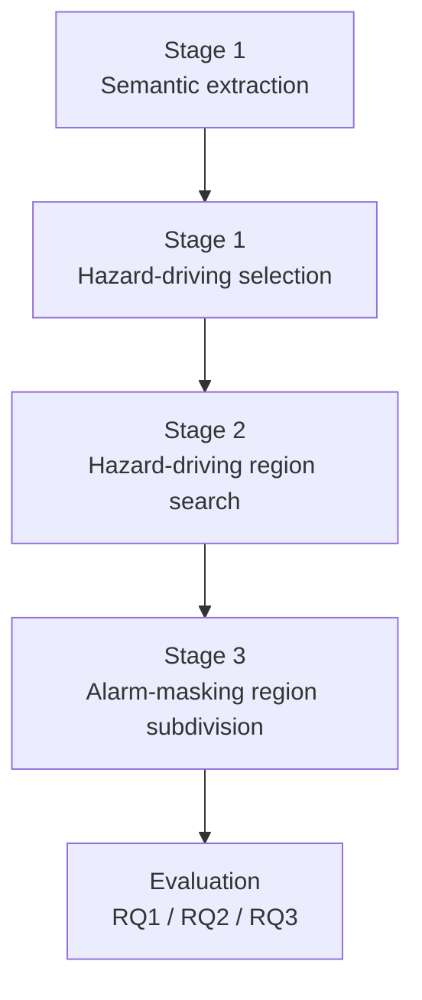

# VeriPro

VeriPro is a research artifact for reproducing multi-point coordinated vulnerability discovery in DCS (Distributed Control System) process alarm logic through offline closed-loop Reach-Avoid analysis. Given a target control program and an executable closed-loop environment, VeriPro identifies parameter regions where coordinated injection on a hazard-driving variable and an alarm-masking variable can drive the process to a hazardous state without triggering process alarms.

## Method Workflow



## Directory Structure

```
veripro-artifact/
├── README.md                    This file
├── LICENSE                      MIT License
├── requirements.txt             Python dependencies
│
├── src/                         Core methodology implementation
│   ├── protocols.py             Shared interfaces (§3)
│   ├── stage1_identifying_hazard_driving_variables/   (§3.2)
│   │   ├── semantic_extraction.py                     §3.2.1: AST → semantic model
│   │   └── hazard_driving_selection.py                §3.2.2: attack tree ranking
│   ├── stage2_searching_hazard_driving_regions/       (§3.3)
│   │   ├── base_region_search.py                      §3.3.1: binary boundary refinement
│   │   └── conditional_extension.py                   §3.3.2: coordinated extension
│   ├── stage3_searching_alarm_masking_regions/        (§3.4)
│   │   └── subregion_subdivision.py                   §3.4: dynamic B_omega + D-metric merge/split
│   └── stage4_executor/
│       └── generic_runtime_executor.py                Shared runtime execution
│
├── simulators/                  Closed-loop simulation environments
│   ├── boiler_ccs/              Boiler-side Coordinated Control System
│   │   ├── controller.py        CCS PID controllers (fuel, feedwater, steam)
│   │   ├── physical_process.py  Boiler thermal dynamics model
│   │   ├── simulation.py        Closed-loop orchestration with injection hooks
│   │   ├── runtime_executor.py  Standardized simulation execution engine
│   │   └── system_manifest.json Platform configuration
│   └── tennessee_eastman/       Tennessee Eastman Process benchmark
│       ├── controller.py        Decentralized PI/PID controllers
│       ├── physical_process.py  TEP simulator wrapper
│       ├── simulation.py        Closed-loop orchestration
│       ├── runtime_executor.py  Standardized simulation execution engine
│       ├── system_manifest.json Platform configuration
│       ├── te_steady_snapshot.pkl  Pre-computed steady-state initialization
│       └── tep/                 TEP process model implementation
│
├── evaluation/                  Research question evaluation scripts
│   ├── run_all.py               One-command full reproduction
│   ├── rq1_semantic_completeness.py    RQ1 (§4.2)
│   ├── rq2_boiler_summary.py           RQ2 (§4.3) boiler summary
│   ├── rq2_te_summary.py               RQ2 (§4.3) TE summary
│   ├── rq2_te_ablation.py              RQ2 (§4.3) TE baselines
│   └── rq3_region_quality.py           RQ3 (§4.4)
│
├── results/                     Pre-computed results for verification
│   ├── stage1/                  Semantic models and expert baselines
│   ├── stage2/                  Boundary search outputs (base + conditional)
│   ├── stage3/                  Subregions and masking sets
│   ├── rq1/                     RQ1 evaluation data
│   ├── rq2/                     RQ2 evaluation data (incl. baselines)
│   └── rq3/                     RQ3 evaluation data
```

## Requirements & Installation

- Python 3.10 or later
- Dependencies listed in `requirements.txt`

```bash
pip install -r requirements.txt
```

## Minimal Example

The smallest end-to-end command is the bundled RQ1 evaluation, which reads the released Stage 1 and Stage 2 artifacts and refreshes the summary under `results/rq1/`.

```bash
python evaluation/rq1_semantic_completeness.py
```

## Configuration

- `--workers` controls parallelism for simulation-heavy evaluation scripts.
- Stage 1 target selection uses `--target boiler` or `--target TE`.
- Stage 2 and Stage 3 scripts read platform settings from `simulators/*/system_manifest.json`.

## Step-by-Step Reproduction

### Stage 1: Identifying Hazard-Driving Variables

```bash
# Boiler CCS
python -m src.stage1_identifying_hazard_driving_variables.semantic_extraction --target boiler
python -m src.stage1_identifying_hazard_driving_variables.hazard_driving_selection --semantic-model results/stage1/boiler_program_extraction.json --manifest simulators/boiler_ccs/system_manifest.json --output results/stage2/initial_combo_boiler.json

# Tennessee Eastman
python -m src.stage1_identifying_hazard_driving_variables.semantic_extraction --target TE
python -m src.stage1_identifying_hazard_driving_variables.hazard_driving_selection --semantic-model results/stage1/semantic_model_te.json --manifest simulators/tennessee_eastman/system_manifest.json --output results/stage2/initial_combo_te.json
```

### Stage 2: Searching Hazard-Driving Regions

```bash
# Boiler CCS conditional extension from the bundled base boundary
python -m src.stage2_searching_hazard_driving_regions.conditional_extension --boundary-path results/stage2/boiler_base_boundary.json --output-path results/stage2/boiler_conditional_expansion.json --workers 8

# Base-region outputs for Boiler CCS and Tennessee Eastman are bundled under
# results/stage2/. The base search implementation is exposed as Python
# functions in src/stage2_searching_hazard_driving_regions/base_region_search.py.
```

### Stage 3: Searching Alarm-Masking Regions

```bash
# Boiler CCS
python -m src.stage3_searching_alarm_masking_regions.subregion_subdivision --target boiler

# Tennessee Eastman
python -m src.stage3_searching_alarm_masking_regions.subregion_subdivision --target te
```

Current stage3 canonical outputs:

- `results/stage3/boiler_stage3_fuel_steam_full.json`
- `results/stage3/boiler_stage3_subregion_2d_base.json`
- `results/stage3/boiler_stage3_combined_regions.json`
- `results/stage3/boiler_stage3_cond_slope_refine.json`
- `results/stage3/te_stage3_xmv07_sp3_full.json`
- `results/stage3/te_stage3_subregion_2d_base.json`

### Research Questions

```bash
python evaluation/rq1_semantic_completeness.py
python evaluation/rq2_boiler_summary.py
python evaluation/rq2_te_summary.py
python evaluation/rq2_te_ablation.py
python evaluation/rq3_region_quality.py
```

## Results Verification

Pre-computed results are provided in the `results/` directory. Running the evaluation scripts refreshes the corresponding files in place. To verify reproducibility:

1. **Compare JSON outputs**: Key metrics (boundary point counts, area ratios, pass rates) should match within numerical tolerance (< 1e-6 for deterministic computations).

2. **Parallel execution**: Use `--workers N` to parallelize simulation-heavy stages. With 16 workers, total runtime drops to approximately 3-4 hours.

## Known Limitations

- This repository is released as a reproducibility artifact, not a general-purpose industrial control toolkit.
- The bundled Stage 2 and Stage 3 outputs are release baselines. Re-running upstream stages may produce numerically different intermediate artifacts while preserving the same methodological flow.
- The Tennessee Eastman simulator depends on bundled steady-state snapshot files for fast initialization.
- The artifact does not ship proprietary DCS engineering files, deployment assets, or operator-facing HMIs.

## Case Study Description

### Boiler-Side Coordinated Control System (Boiler CCS)

A thermal power unit's boiler-side coordinated control system managing the energy-conversion path including fuel supply, combustion, steam generation, and feedwater compensation. The system contains tightly coupled PID controllers for fuel flow, feedwater flow, and main-steam pressure. Process alarms monitor deviations between setpoints and measurements for key thermal-control variables. Hazard predicates define threshold violations over steam temperature, feedwater flow, and main-steam pressure.

| Property | Value |
|----------|-------|
| Hazard-driving variable | `fuel_command` |
| Alarm-masking variable | `steam_setpoint` |
| Control period | 0.1 s |
| Writable variables | 21 |
| Alarm predicates | 3 |
| Hazard predicates | 3 |

### Tennessee Eastman Process (TE)

A continuous chemical-production benchmark with reaction, separation, recycle, and refining stages. The system contains decentralized PI/PID controllers across multiple process units. Process alarms monitor observable deviations between measurements and setpoints across reactor, separator, and recycle loops. Hazard predicates define threshold violations over reactor temperature, liquid level, and separator pressure.

| Property | Value |
|----------|-------|
| Hazard-driving variable | `xmv_07` |
| Alarm-masking variable | `setpoint_3` (reactor temperature SP) |
| Control period | 1.0 s |
| Writable variables | 63 |
| Alarm predicates | 7 |
| Hazard predicates | 8 |
